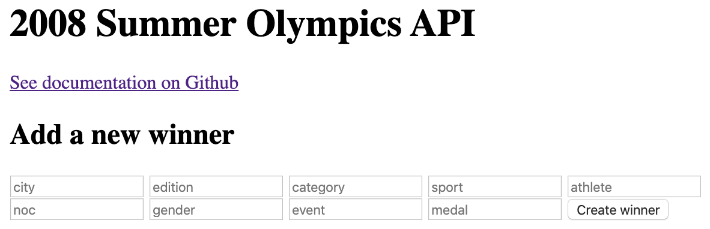

# api-solo-project

_This was created during my time as a student at Code Chrysalis_

# Summer Olympics 2008 Winners API

This is a CRUD API using Postgres, Knex and RESTful principles. It contains the medal winners from the 2008 Summer Olympics. It is displayed with an html frontend.



---

## Getting Started

### Postgres

You will need [Postgres](https://postgresapp.com/) installed.

Create a database for this project by running:

```bash
    echo "CREATE DATABASE olympics;" | psql
```

### Installing Dependencies and Startup

To install dependencies:

```bash
    yarn
```

To set up the database, run migrations and seeds:

```bash
    yarn migrate
```

```bash
    yarn seed
```

To start the app:

```bash
    nodemon .
```

---

To roll back migrations:

```bash
    yarn rollback
```

---

### API endpoints

| endpoint                  | method | result                                    |
| ------------------------- | ------ | ----------------------------------------- |
| `api/winners`             | GET    | Shows all winners                         |
| `api/winners/countryCode` | GET    | Shows all winners from a specific country |
| `index.html`              | POST   | this form will add a winner               |
